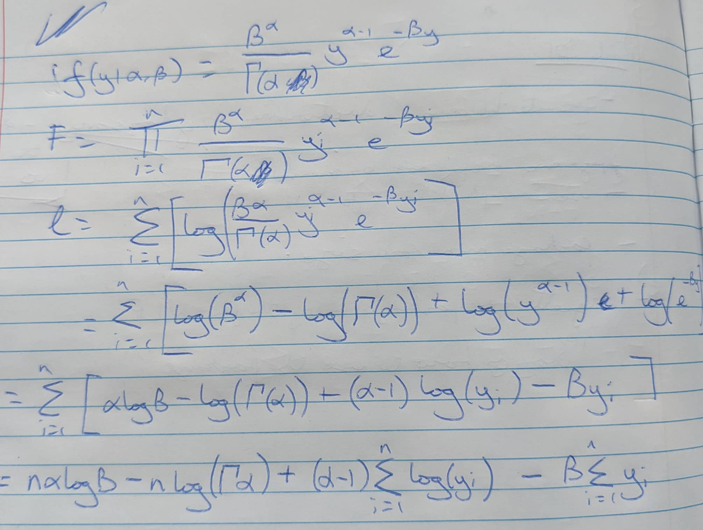

```{r setup, include=FALSE}
knitr::opts_chunk$set(echo = TRUE)
```

```{r}
pacman::p_load(Rcpp, sloop, pander)

f1 <- function(x, a=0) {
  # square each of the elements of x after subtracting scalar a
  return((x-a)^2)
}

f2 <- function(x,a=c(0,0)) {
  # distance of x from the the point a in the 2D plane
  return(sqrt((x[1]-a[1])^2 + (x[2]-a[2])^2))
}
```


# Question 1

Write R code to find the minimum value of the function f1() in the interval −100<x<100 when a=4 using optimize(). Show the R code and output.

```{r}
xmin <- stats::optimize(f1, c(-100,100), a = 4) 
print(xmin)
```
Therefore minimum is at x = 4 where output is 0

# Question 2

Write R code to find the minimum value of the function f2() when a=(1,2) using optim(). Use x=c(0,0) as a starting guess. Show the R code and output.

```{r}
x2min <- stats::optim(c(0,0), f2, a = c(1,2)) 
print(x2min)
```
The function found that it could find an almost 0 distance if it selected the exact point of (1,2) after 113 iterations. While the distance is not exactly 0 it effectively is.

# Question 3

```{r}
koptim <- function(par, fn, ..., control = list(fnscale = 1)){
  if(length(par)==1){
    max_trigger <- ifelse(control$fnscale == -1, T,
                          ifelse(control$fnscale == 1, F,
                                 stop('fnscale value 1 for minimum and -1 for maximum')))
    trigger <- F
    increase_distance <- 5
    increase_counter <- 0
    while(trigger == F){
      if(increase_counter >= 10){stop(paste('No max/min found within +/- ',
                                            5^10,
                                            ' of estimate, please consider search start and max/min choice'))}
      xmina <- stats::optimize(fn, c(par-increase_distance,
                                     par+increase_distance),
                               ...,
                               maximum = max_trigger )
      xminb <- stats::optimize(fn, c(par-(5*increase_distance),
                                     par+(5*increase_distance)),
                               ...,
                               maximum = max_trigger)
      
      if(any(is.null(c(xmina$minimum, xminb$minimum))) & increase_counter < 10){
        increase_distance <- 5 * increase_distance
        increase_counter <-  increase_counter + 1
        }
      else if(xmina$minimum != xminb$minimum & increase_counter < 10){
        increase_distance <- 5 * increase_distance
        increase_counter <- increase_counter + 1
      } else{
        
        trigger <- T
        outputs<- list(par = c(xmina$minimum),
                       value = c(xmina$objective))
      }
    }
  }
  else if(length(par)>1){
    xmin <- stats::optim(par = par, fn = fn, control = control, ...)
    outputs<- list(par = c(xmin$par),
                       value = c(xmin$value))
  }
  
  
  return(outputs)
}

```


# Question 4


```{r}
koptim(c(0),f1, a = c(4))
```
```{r}
koptim(c(0,0),f2, a = c(1,2))
```

# Question 5

```{r}
koptim <- function(par, fn, ..., control = list(fnscale = 1)){
  if(length(par)==1){
    max_trigger <- ifelse(control$fnscale == -1, T,
                          ifelse(control$fnscale == 1, F,
                                 stop('fnscale value 1 for minimum and -1 for maximum')))
    trigger <- F
    increase_distance <- 5
    increase_counter <- 0
    while(trigger == F){
      if(increase_counter >= 10){
        stop(paste('No max/min found within +/- ',5^10,
                   ' of estimate, please consider search start and max/min choice'))}
      xmina <- stats::optimize(fn, c(par-increase_distance,
                                     par+increase_distance),
                               ...,
                               maximum = max_trigger )
      xminb <- stats::optimize(fn, c(par-(5*increase_distance),
                                     par+(5*increase_distance)),
                               ...,
                               maximum = max_trigger)
      
      if(any(is.null(c(xmina$minimum, xminb$minimum))) & increase_counter < 10){
        increase_distance <- 5 * increase_distance
        increase_counter <-  increase_counter + 1
        }
      else if(xmina$minimum != xminb$minimum & increase_counter < 10){
        increase_distance <- 5 * increase_distance
        increase_counter <- increase_counter + 1
      } else{
        
        trigger <- T
        outputs<- list(par = c(xmina$minimum),
                       value = c(xmina$objective),
                   maximum = ifelse(control$fnscale == -1, 'maximum', 'minimum'))
      }
    }
  }
  else if(length(par)>1){
    xmin <- stats::optim(par = par, fn = fn, control = control, ...)
    outputs<- list(par = c(xmin$par),
                   value = c(xmin$value),
                   maximum = ifelse(control$fnscale == -1, 'maximum', 'minimum'))
  }
  
  class(outputs) <- "koptim"
  return(outputs)
}

print.koptim <- function(koptim_object){
  minmax <- koptim_object$maximum
  if(length(koptim_object$par) > 1){
    cat('The ',minmax,' of the function occurs at x=(',
        paste(koptim_object$par, collapse = ', '),') \n')
    cat('where the function value is ',koptim_object$value, '\n')
  }
  else if(length(koptim_object$par) == 1){
    cat('The ',minmax,' of the function occurs at x=(',
        koptim_object$par,') \n')
    cat('where the function value is ',koptim_object$value,'\n')
  }
}

x <- koptim(c(0,0),f2, a = c(1,2))
y <- koptim(c(0),f1, a = c(4))
print(x)
print(y)


```

# Question 6

```{r}
#output object of the function shows returns s3 object
sloop::otype(x)

#shows the print.koptim function is an s3 method
sloop::ftype(print.koptim)
```

# Question 7

Derivation:

{width=100%, height=100%}
```{r}
llikef1<- function(par, y){
  if(length(par)!= 2){stop('par should be numeric vector length 2')}
  else if(!is.numeric(par)){stop('must be numeric vector')}
  alpha = exp(par[1])
  beta = exp(par[2])
  n <- length(y)
  f_of_y <- (n*alpha*log(beta))-(n*lgamma(alpha))+((alpha-1)*sum(log(y))) - (beta*sum(y))
  return(f_of_y)
}
```

# Question 8

```{r}
llikef2 <- function(par, y){
  if(length(par)!= 2){stop('par should be numeric vector length 2')}
  else if(!is.numeric(par)){stop('must be numeric vector')}
  alpha = exp(par[1])
  beta = exp(par[2])
  n <- 0
  sum_y <- 0
  sum_log_y <- 0
  for(i in y){
    n <- n+1
    sum_y <- sum_y + i
    sum_log_y <- sum_log_y + log(i)
  }
  f_of_y <- (n*alpha*log(beta))-(n*lgamma(alpha))+((alpha-1)*sum_log_y) - (beta*sum_y)
  return(f_of_y)
}

```


# Question 9

```{r}
set.seed(-1)
z <- rgamma(10000, 1, 2)

time_llikef1 <- vector(mode="numeric", length=100)
time_llikef2 <- vector(mode="numeric", length=100)
for(i in 1:100){
  time_llikef1[i] <- system.time(koptim(par = c(1,1),fn = llikef1, y = z, control = list(fnscale = -1)))[3]
  time_llikef2[i] <- system.time(koptim(par = c(1,1),fn = llikef2, y = z, control = list(fnscale = -1)))[3]
}

boxplot(cbind(time_llikef1, time_llikef2))
```


# Question 10

Two options provided - one the looped version which I assume is what was desired to show that loops in cpp are as quick as non looped in R, but then an alternate that does not require any direct looping in CPP either.
```{R, eval=FALSE}
cppFunction('double llikef3(NumericVector par, NumericVector y) {
  double alpha = exp(par[0]);
  double beta = exp(par[1]);
  int n = y.length();
  double sum_y = 0;
  double sum_log_y = 0;
  for (int i = 0; i < n; i++){
    sum_y += y[i];
    sum_log_y += log(y[i]);
  }
  return (n*alpha*log(beta))-(n*lgamma(alpha))+((alpha-1)*sum_log_y) - (beta*sum_y);
}'
)


cppFunction('double llikef4(NumericVector par, NumericVector y) {
  double alpha = exp(par[0]);
  double beta = exp(par[1]);
  int n = y.length();
  double sum_y = sum(y);
  double sum_log_y = sum(log(y));
  return (n*alpha*log(beta))-(n*lgamma(alpha))+((alpha-1)*sum_log_y) - (beta*sum_y);
}'
)

```

```{r}
sourceCpp('RCP_function.cpp')
set.seed(-1)
z <- rgamma(10000, 1, 2)
pander(c(Function1 = llikef1(c(1,1), z), Function2 = llikef2(c(1,1), z), Function3 = llikef3(c(1,1), z), Function4 = llikef4(c(1,1), z)))
```


# Question 11

Switching to Sys.time from System.time for more accurate results:

```{r}
set.seed(-1)
z <- rgamma(10000, 1, 2)

time_llikef1 <- vector(mode="numeric", length=100)
time_llikef2 <- vector(mode="numeric", length=100)
time_llikef3 <- vector(mode="numeric", length=100)
time_llikef4 <- vector(mode="numeric", length=100)
for(i in 1:100){
  s <- Sys.time()
  koptim(par = c(1,1),fn = llikef1, y = z, control = list(fnscale = -1))
  time_llikef1[i] <- Sys.time() - s
  
  s <- Sys.time()
  koptim(par = c(1,1),fn = llikef2, y = z, control = list(fnscale = -1))
  time_llikef2[i] <- Sys.time() - s
  
  s <- Sys.time()
  koptim(par = c(1,1),fn = llikef3, y = z, control = list(fnscale = -1))
  time_llikef3[i] <- Sys.time() - s
  
  s <- Sys.time()
  koptim(par = c(1,1),fn = llikef4, y = z, control = list(fnscale = -1))
  time_llikef4[i] <- Sys.time() - s
}

boxplot(cbind(time_llikef1, time_llikef2, time_llikef3, time_llikef4 ))
```
Shows that non looped and Rcpp function are much quicker. Examining the three of them together shows that these have almost identical distributions for run time with Rcpp variations being slightly quicker.

```{r}
boxplot(cbind(time_llikef1, time_llikef3, time_llikef4 ))
```


